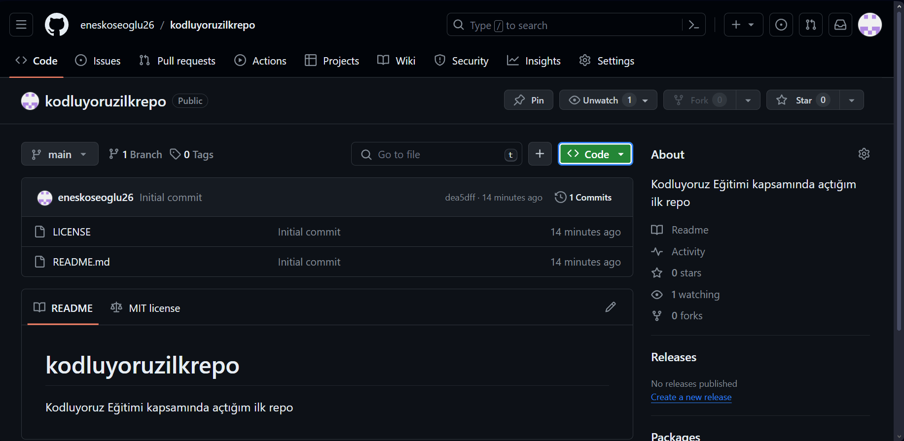

# Kodluyoruz Ilk Repo
Bu repo [Kodluyoruz](kodluyoruz.org) Git eğitimi sonunda oluşturduğum ilk repo. İçerisinde bir adet README dosyası ve bir adet index.html barındırıyor.


## Installation
Öncelikle projeyi klonlayın(Buraya reponuzdan aldığnız link gelecek)
`git clone https://github.com/eneskoseoglu26/kodluyoruzilkrepo.git`

## Usage
Projeyi klonladıktan sonra Visual Studio Code programından açınız.
Linux için:
```
cd kodluyouruzilkrepo
code .
```

## Contributing
Pull requestler kabul edilir. Büyük değişiklikler için, lütfen önce neyi değiştirmek istediğinizi tartışmak için bir konu açınız.

# License
[MIT](https://choosealicense.com/licenses/mit/)